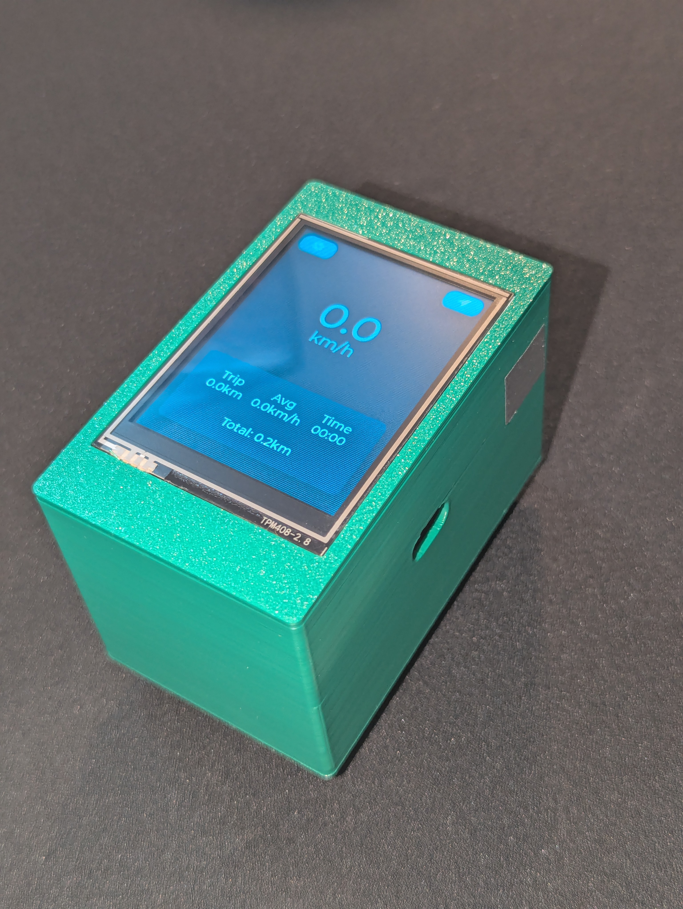
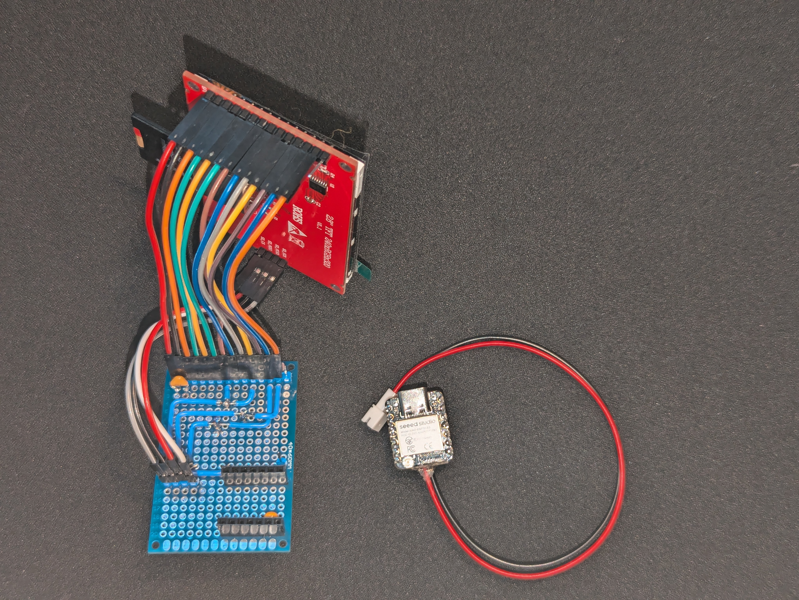
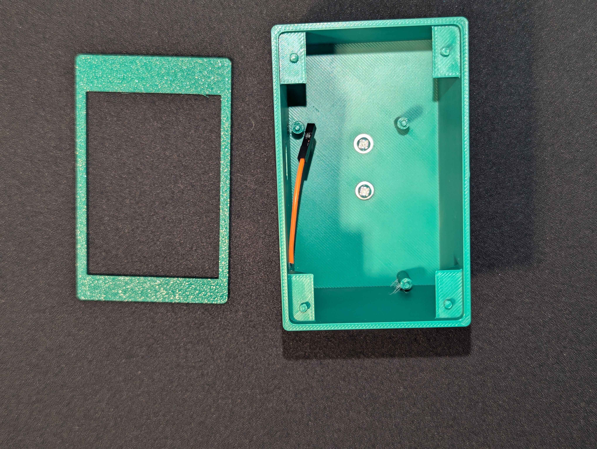
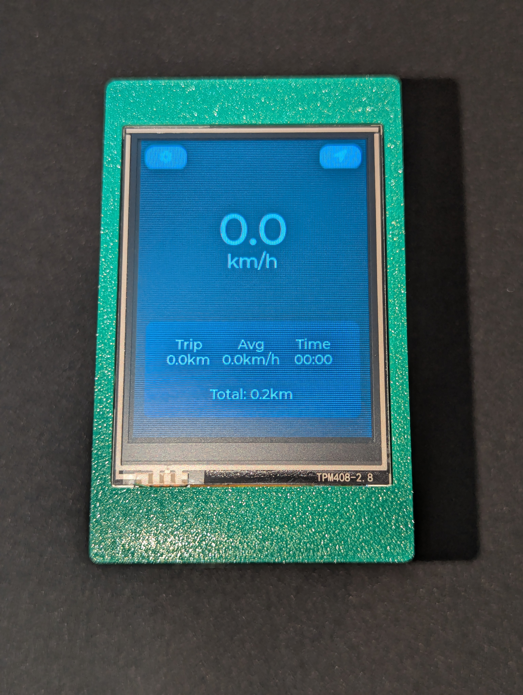
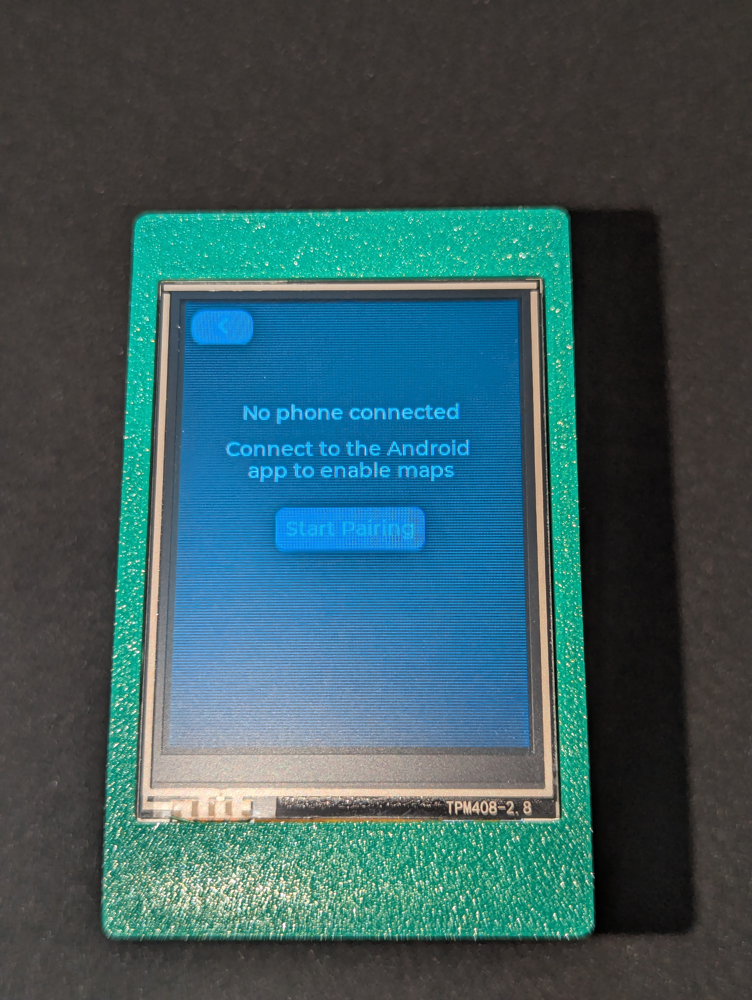
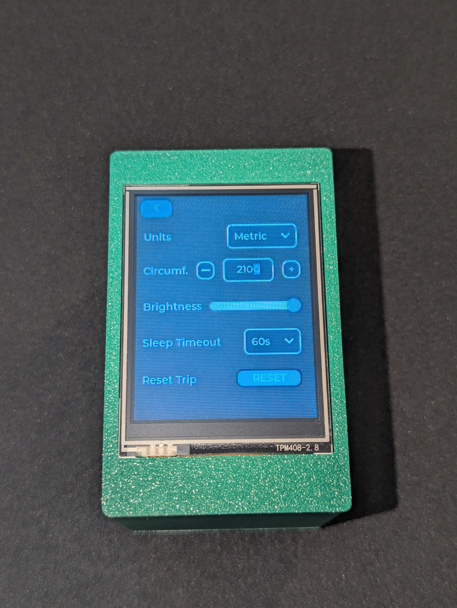

# Wireless Bike Computer


This project is a small wireless bike computer built around two ESP32 modules. It measures wheel movement on the fork, sends the data wirelessly to a handlebar unit, computes ride metrics, and shows them on a touchscreen display.

The project also includes a simple Android app. The phone sends its current coordinates to the bike computer over BLE, and the main module can render offline map tiles from the SD card.



## What It Does

The system is split into three parts:

- The wheel module is mounted near the wheel. It uses a Hall effect sensor and a magnet to measure wheel revolutions.
- The main module is mounted on the handlebars. It receives wheel packets, computes the metrics, handles the UI, stores persistent data, and renders maps.
- The Android app runs on the phone. It scans for the bike computer over BLE and sends location coordinates to it.

The two ESP32 modules communicate using ESP-NOW. The main module communicates with the phone using Bluetooth Low Energy.

Main features:

- Current speed
- Trip distance
- Average speed
- Moving time
- Total distance
- Touchscreen UI with metrics, maps, and settings screens
- Persistent settings and ride metrics using NVS
- Configurable wheel circumference, units, brightness, and sleep timeout
- BLE location transfer from Android
- Offline slippy-map tile rendering from SD card
- 3D printed cases for both modules

## How It Works

The wheel module is based on a Seeed Studio XIAO ESP32-C6. It uses the low-power core to detect wheel events and measure the time between revolutions. The high-performance core stays in deep sleep most of the time and only wakes up when data needs to be sent.

The wheel module sends packets that contain:

- a sequence number
- cumulative wheel rotations
- cumulative moving time
- recent wheel periods

The main module is based on a Seeed Studio XIAO ESP32-S3. It receives these packets using ESP-NOW, validates them, computes the ride metrics, and updates the LVGL interface. Metrics are stored internally in metric units and converted only when they are shown on screen.

For the maps screen, the main module starts BLE advertising when the user presses the pairing button. The Android app connects to it and writes the current phone coordinates to a BLE characteristic. The firmware then projects the coordinates to slippy-map tile coordinates and renders the needed RGB565 tiles from the SD card. The current location marker stays fixed in the center of the map viewport.

## Photos

| Main module | Wheel module |
| --- | --- |
|  |  |
|  |  |

UI screens:

| Metrics | Maps | Settings |
| --- | --- | --- |
|  |  |  |

## Hardware

### Wheel Module

Main parts:

- Seeed Studio XIAO ESP32-C6
- US5881 Hall effect sensor
- Magnet attached to a wheel spoke
- 5 V boost converter for the Hall sensor
- LiPo battery
- Pull-up resistor and decoupling capacitors

Pinout:

| ESP32-C6 pin | Function |
| --- | --- |
| GPIO0 | Hall effect sensor output |

### Main Module

Main parts:

- Seeed Studio XIAO ESP32-S3
- 2.8 inch ILI9341 display
- XPT2046 touch controller
- SD card reader
- LiPo battery

Pinout:

| ESP32-S3 pin | Function |
| --- | --- |
| GPIO1 | Capacitive touch wake pin |
| GPIO2 | Touch CS |
| GPIO3 | LCD backlight PWM |
| GPIO4 | LCD D/C |
| GPIO5 | LCD reset |
| GPIO6 | LCD CS |
| GPIO7 | SPI CLK, shared |
| GPIO8 | SPI MISO, shared |
| GPIO9 | SPI MOSI, shared |
| GPIO43 | SD card CS |
| GPIO44 | Free |

The LCD, touch controller, and SD card reader share the same SPI bus. Each device has its own chip-select line.

The electrical schematic is available in [`hardware/electrical_schematic.pdf`](hardware/electrical_schematic.pdf). The KiCad project is in [`hardware/bike_computer/`](hardware/bike_computer/).

## Mechanical Design

The project includes 3D printed cases for both modules. The models are in [`mechanical/`](mechanical/).

Main files:

- Main module case: [`mechanical/models/main_module/`](mechanical/models/main_module/)
- Wheel module case: [`mechanical/models/wheel_module/`](mechanical/models/wheel_module/)
- Assembled Fusion models: [`mechanical/models/assembled/`](mechanical/models/assembled/)

The main module case includes a Garmin quarter-turn mount model, so it can be mounted on the handlebars in a similar way to common bike computers.

## Software Structure

The source code is inside [`src/`](src/).

```text
src/
  modules/
    common/        shared ESP-NOW packet definition
    wheel_module/  ESP32-C6 wheel sensor firmware
    main_module/   ESP32-S3 display and application firmware
  android-app/     Android companion app
  tools/           helper tools, including map tile conversion
```

The main module firmware is split into:

- `constants/` for pin assignments and configuration values
- `hardware/` for SPI, display, touch, and SD card setup
- `app/` for the application logic, metrics, storage, BLE, UI presenter, and map renderer
- `components/ui/` for the Squareline Studio generated LVGL UI

The Android app is written in Kotlin. It uses a foreground service for BLE scanning, BLE connection state, location updates, and retrying location writes while the phone screen is off.

## Maps

The firmware does not decode PNG or JPG tiles directly on the ESP32. The tiles are converted on the computer to raw RGB565 files and then copied to the SD card.

The expected SD card layout is:

```text
/sdcard/maps/<zoom>/<x>/<y>.rgb565
```

For example, for zoom level 16:

```text
/sdcard/maps/16/37474/23718.rgb565
```

The conversion tool is:

```sh
python3 src/tools/convert_raster_tiles.py <input-tile-root> <format> <output-root>
```

Example:

```sh
python3 src/tools/convert_raster_tiles.py raster_tiles_example/Bucharest/16 png raster_tiles_converted/16 --overwrite
```

The output directory can then be copied to the SD card under `maps/16`.

## Setup

Required tools:

- ESP-IDF 6.0.1 or a compatible ESP-IDF version
- Python 3
- Android Studio for the Android app
- Pillow and optionally NumPy for the tile conversion tool
- Squareline Studio only if the UI project needs to be edited

Install Python dependencies for the tile converter:

```sh
python3 -m pip install pillow numpy
```

The ESP-IDF projects use `sdkconfig.defaults`, so the target and important options should already be set. The main module enables PSRAM because the map canvas buffer is too large for internal SRAM.

## Build and Flash

### Wheel Module

```sh
cd src/modules/wheel_module
idf.py build
idf.py flash monitor
```

This builds and flashes the ESP32-C6 wheel module firmware.

### Main Module

```sh
cd src/modules/main_module
idf.py build
idf.py flash monitor
```

This builds and flashes the ESP32-S3 main module firmware.

### Android App

```sh
cd src/android-app
./gradlew assembleDebug
```

The generated debug APK can be installed from Android Studio or with `adb install`.

The app needs Bluetooth, location, and notification permissions. Location must also be enabled on the phone.

## Running the System

1. Flash the wheel module and main module.
2. (Optional) Copy converted map tiles to the SD card under `maps/<zoom>/`, then insert the SD card into the display module .
4. Power the wheel module and place the magnet near the Hall sensor path.
5. Power the main module.
6. (Optional) Open the Android app.
7. (Optional) Go to the maps screen on the bike computer and press the pairing button.
8. (Optional) Start scanning in the Android app.

After the phone connects, the app sends coordinates to the ESP32-S3 and the maps screen updates with the current location.

## Current Limitations

- The map zoom level is fixed in firmware.
- The project is still a prototype, with hand-wired hardware.
- Battery percentage measurement is not implemented yet.
- Map data must be prepared manually and copied to the SD card.
- BLE and ESP-NOW share the same 2.4 GHz radio, so connection behavior can depend on signal conditions and phone behavior.